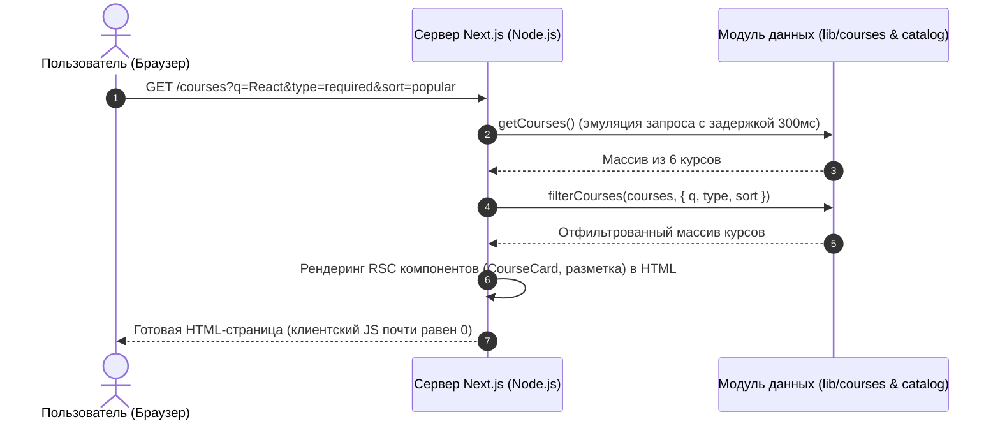

# Полное руководство по проекту (TUTOR)
## Лабораторная работа: «Каталог курсов по веб-разработке на Next.js 16»

Данный документ содержит исчерпывающее описание технического задания (ТЗ), архитектуры проекта, используемых технологий, структуры файлов, принципов работы и готовых ответов для защиты лабораторной работы перед преподавателем.

---

## Содержание
1. [Суть технического задания (ТЗ)](#1-суть-технического-задания-тз)
2. [Используемый стек технологий](#2-используемый-стек-технологий)
3. [Архитектура: где Node.js, а где React](#3-архитектура-где-nodejs-а-где-react)
4. [Структура файлов и назначение каждого модуля](#4-структура-файлов-и-назначение-каждого-модуля)
5. [Как проект работает изнутри (Data Flow)](#5-как-проект-работает-изнутри-data-flow)
6. [Автоматические тесты (что они проверяют)](#6-автоматические-тесты-что-они-проверяют)
7. [Шпаргалка для защиты перед преподавателем (Вопросы и ответы)](#7-шпаргалка-для-защиты-перед-преподавателем-вопросы-и-ответы)
8. [Команды запуска и проверки](#8-команды-запуска-и-проверки)

---

## 1. Суть технического задания (ТЗ)

**Цель работы:** разработать учебный веб-сервис «Каталог курсов» с использованием современного фреймворка **Next.js (App Router)**, продемонстрировав глубокое понимание концепции **React Server Components (RSC)** и минимизации клиентского JavaScript-бандла.

### Основные требования задания:
1. **Маршрутизация (4 ключевых маршрута):**
   - `/` — Главная страница (статическая).
   - `/about` — Страница «О проекте» с описанием целей работы, стека и часто задаваемых вопросов (статическая).
   - `/courses` — Страница каталога со списком курсов, формой поиска, фильтрацией по типу и сортировкой (серверный рендеринг SSR).
   - `/courses/[id]` — Динамическая страница конкретного курса с детальной информацией, темами и кнопкой лайка (статическая генерация SSG).
2. **Данные и эмуляция бэкенда:**
   - 6 обязательных курсов с фиксированными параметрами: ID, название, описание, кредиты (от 4 до 5), признак электива (`isElective`), начальное количество лайков.
   - Асинхронное получение данных (`getCourses()`, `getCourse(id)`) с искусственной задержкой в **300 мс** для имитации реальной базы данных или сетевого API.
3. **Архитектурное ограничение (самое строгое требование):**
   - **Все страницы и компоненты должны быть Server Components (RSC).**
   - Единственным клиентским компонентом во всём приложении (`"use client"`) имеет право быть только кнопка лайка — `components/LikeButton.tsx`. Никакие другие файлы не должны содержать `"use client"`.
4. **Фильтрация, поиск и сортировка:**
   - Поиск по названию (нечувствителен к регистру, обрезает лишние пробелы).
   - Фильтр по типу курса: Все (`all`), Обязательные (`required`), По выбору (`elective`).
   - Сортировка: По умолчанию (`default`), По популярности/лайкам (`popular`), По кредитам (`credits`), По названию (`title`).
   - Состояние фильтров сохраняется в URL (query string: `?q=react&type=required&sort=popular`). Это даёт возможность делиться ссылкой на выборку.
5. **Статическая генерация (SSG):**
   - Для маршрута `/courses/[id]` должна использоваться функция `generateStaticParams()`, чтобы страницы всех 6 курсов генерировались заранее на этапе сборки (`npm run build`).
6. **Обработка ошибок и загрузка:**
   - Несуществующий ID курса (например, `/courses/unknown-id`) должен вызывать функцию `notFound()` и отображать дружелюбную страницу 404 со ссылкой возврата в каталог.
   - Наличие компонентов-скелетонов `loading.tsx` для отображения плавной анимации загрузки во время ожидания серверных данных.

---

## 2. Используемый стек технологий

| Технология | Версия | Назначение в проекте |
|---|---|---|
| **Next.js** | 16.x | Полнофункциональный (Fullstack) React-фреймворк с маршрутизацией на основе файловой системы (App Router) |
| **React** | 19.x | Библиотека UI. Используются серверные компоненты (RSC) и хук состояния `useState` в клиентском компоненте |
| **TypeScript** | 5.x | Строгая типизация данных курсов, параметров маршрутов (`params`, `searchParams`) и пропсов компонентов |
| **Tailwind CSS** | 4.x | Утилитарные CSS-стили для создания чистого, аккуратного и полностью адаптивного интерфейса |
| **Node.js Test Runner** | встроенный (`node:test`) | Модульное тестирование бизнес-логики без сторонних тяжёлых библиотек вроде Jest |

---

## 3. Архитектура: где Node.js, а где React

Так как в **Next.js 16** бэкенд и фронтенд объединены, проект не разделяется на папки `server/` и `client/`. Вместо этого используется трёхслойная архитектура:

```text
course-catalog/
│
├── 🟢 1. СЛОЙ NODE.JS (Сервер, среда выполнения, конфиги, тесты, данные)
│   ├── package.json          # Манифест проекта и npm-скрипты
│   ├── next.config.ts        # Настройки сборщика Next.js
│   ├── tsconfig.json         # Конфигурация компилятора TypeScript
│   ├── eslint.config.mjs     # Правила статического анализа кода (ESLint)
│   ├── postcss.config.mjs    # Подключение утилит обработки CSS (PostCSS)
│   ├── tests/catalog.test.mjs# Автотесты логики (запускаются командой `node --test`)
│   └── lib/                  # Серверная бизнес-логика (эмуляция бэкенда/БД):
│       ├── courses.ts        # Исходные данные 6 курсов и асинхронные методы
│       ├── catalog.ts        # Функции фильтрации и сортировки
│       └── course-details.ts # Расширенная информация (темы, пререквизиты)
│
├── 🔵 2. СЛОЙ REACT (Клиентская часть, браузерный интерактив)
│   └── components/
│       └── LikeButton.tsx    # Единственный клиентский компонент ("use client").
│                             # Исполняется в браузере: хранит useState, обрабатывает клики.
│
└── 🟣 3. ГИБРИДНЫЙ СЛОЙ (React Server Components — React JSX + выполнение в Node.js)
    ├── components/
    │   └── CourseCard.tsx    # Серверный компонент карточки курса
    └── app/                  # Страницы и шаблоны маршрутизатора:
        ├── layout.tsx        # Корневой каркас приложения (шапка, меню, подвал)
        ├── page.tsx          # Главная страница
        ├── about/page.tsx    # Страница «О проекте»
        ├── globals.css       # Глобальные стили Tailwind CSS
        └── courses/
            ├── page.tsx      # Каталог с формой фильтров
            ├── loading.tsx   # Скелетон загрузки списка
            ├── not-found.tsx # Страница «Курс не найден»
            └── [id]/
                ├── page.tsx    # Детальная страница курса (SSG)
                └── loading.tsx # Скелетон загрузки курса
```

### Главная суть разделения:
- **Node.js** выполняет код на сервере: читает файлы, работает с данными в `lib/`, генерирует HTML на этапе сборки и прогоняет тесты.
- **React** описывает декларативный внешний вид (UI). При этом 99% компонентов рендерятся **на сервере в Node.js**, превращаясь в чистый HTML-текст.
- **В браузер клиенту** отправляется всего один интерактивный React-компонент: `LikeButton.tsx`.

---

## 4. Структура файлов и назначение каждого модуля

### 📁 Слой данных и серверной логики (`lib/`)
- **`lib/courses.ts`**:
  - Содержит TypeScript-тип `Course` (id, title, description, credits, isElective, likes).
  - Массив `COURSES` из 6 обязательных курсов (Modern Frontend, Backend FastAPI, PostgreSQL, API Design, Web Security, AI Integration).
  - Функция `getCourses()` — возвращает копию массива с задержкой 300 мс (`setTimeout`).
  - Функция `getCourse(id)` — ищет курс по его идентификатору.
- **`lib/catalog.ts`**:
  - Содержит чистую функцию `filterCourses(courses, query)`.
  - Реализует поиск: приводит запрос к нижнему регистру и удаляет пробелы (`trim().toLowerCase()`).
  - Фильтрует по обязательным курсам (`isElective === false`) или по выбору (`isElective === true`).
  - Сортирует:
    - `popular` — по убыванию лайков (`b.likes - a.likes`);
    - `credits` — по убыванию кредитов (`b.credits - a.credits`);
    - `title` — по алфавиту названия (`localeCompare`).
    - **Важно:** сортировка использует оператор spread `[...result]`, поэтому исходный массив никогда не мутирует.
  - Вспомогательная функция `first(value)` — корректно извлекает первое значение, если параметр в URL продублирован (например, `?q=a&q=b`).
- **`lib/course-details.ts`**:
  - Хранит детальную программу обучения для каждого курса: направление (`area`), цели обучения (`outcome`), список тем (`topics` — строго по 4 темы на курс) и пререквизиты (`prerequisites`).
  - Функция `detailsFor(id)` безопасно возвращает детали курса или значения по умолчанию.

### 📁 Компоненты (`components/`)
- **`components/CourseCard.tsx` (Server Component):**
  - Отображает карточку курса в каталоге и в блоке «Другие курсы».
  - Вся карточка обёрнута в `<Link href={/courses/${id}}>`.
  - Показывает бейдж («Обязательный» / «По выбору»), название, краткое описание, кредиты и количество лайков.
  - Рендерится на сервере, нулевой оверхед по размеру клиентского JS.
- **`components/LikeButton.tsx` (Client Component):**
  - Помечен директивой `'use client'` в первой строке.
  - Принимает пропс `initialLikes: number`.
  - Создаёт локальное состояние `const [likes, setLikes] = useState(initialLikes)`.
  - По клику вызывает `setLikes(prev => prev + 1)`.
  - Стилизован кнопкой с иконкой сердечка.

### 📁 Страницы и маршруты (`app/`)
- **`app/layout.tsx`:**
  - Корневой шаблон (`RootLayout`), общий для всех страниц сайта.
  - Подключает шрифт Inter и файл стилей `globals.css`.
  - Содержит верхнюю панель навигации (логотип и ссылки «Главная», «Курсы», «О проекте») и футер.
- **`app/page.tsx`:**
  - Главная страница (`/`). Презентует каталог курсов, содержит приветственный баннер с призывом к действию (кнопка перехода в каталог) и карточки основных направлений обучения.
- **`app/about/page.tsx`:**
  - Страница «О проекте» (`/about`). Описывает цели учебной лабораторной работы, архитектурный стек и блок часто задаваемых вопросов (FAQ) на базе нативных HTML-тегов `<details>` и `<summary>`.
- **`app/courses/page.tsx`:**
  - Страница каталога (`/courses`).
  - Читает параметры адресной строки через асинхронный пропс `searchParams: Promise<Query>`.
  - Получает данные с помощью `await getCourses()`.
  - Вызывает `filterCourses()` для применения фильтров.
  - Содержит боковую панель с формой `<Form action="/courses">`:
    - Поле ввода поиска `name="q"`;
    - Радиокнопки типа курса `name="type"`;
    - Выпадающий список сортировки `name="sort"`;
    - Кнопки «Применить» и «Сбросить».
  - Отображает общее количество найденных курсов, сумму кредитов и сетку карточек `CourseCard`. Если ничего не найдено — показывает блок «Курсы не найдены».
- **`app/courses/[id]/page.tsx`:**
  - Динамическая страница отдельного курса (`/courses/[id]`).
  - Функция `generateStaticParams()`: возвращает список всех ID курсов для статической генерации (SSG).
  - Функция `generateMetadata()`: генерирует заголовок вкладки в браузере (название текущего курса).
  - Если курс не найден по ID — вызывает `notFound()`.
  - Отображает навигационную цепочку («хлебные крошки»), расширенное описание, нумерованный список из 4 тем, требования к поступающим, боковую плашку с кредитами и клиентскую кнопку `LikeButton`.
  - Внизу выводит блок из 3 похожих курсов.
- **`app/courses/loading.tsx` и `app/courses/[id]/loading.tsx`:**
  - Скелетоны загрузки с эффектом пульсации (`animate-pulse`). Срабатывают автоматически механизмом Next.js Suspense при ожидании загрузки данных.
- **`app/courses/not-found.tsx`:**
  - Отображается при вызове `notFound()` для несуществующего курса. Показывает код 404, пояснение и кнопку возврата ко всем курсам.

---

## 5. Как проект работает изнутри (Data Flow)

### 1. Как работает переход в каталог и фильтрация:


### 2. Как работает кнопка лайков:
- Страница курса рендерится на сервере с начальным количеством лайков (например, 24).
- Браузер скачивает и «гидратирует» только один компонент — `LikeButton.tsx`.
- При нажатии на кнопку срабатывает функция `onClick`, которая локально меняет состояние через `setLikes(prev => prev + 1)`.
- Никакого повторного запроса на сервер не происходит: лайк мгновенно отображается на экране.
- При перезагрузке страницы (F5) данные сбрасываются обратно к моковым (согласно требованиям учебного задания).

### 3. Как работает статическая генерация (SSG):
- Во время выполнения команды `npm run build` Next.js вызывает функцию `generateStaticParams()` в файле `app/courses/[id]/page.tsx`.
- Функция возвращает массив:
  ```ts
  [{ id: "modern-frontend" }, { id: "backend-fastapi" }, { id: "databases-postgresql" }, ...]
  ```
- Next.js заранее собирает и сохраняет готовые HTML-файлы для всех 6 страниц на диск.
- В результате при переходе пользователя по карточке курса страница открывается **мгновенно**, без ожидания сервера.

---

## 6. Автоматические тесты (что они проверяют)

Все тесты находятся в файле `tests/catalog.test.mjs` и запускаются через встроенный раннер Node.js (`npm test`):

1. **`search is case-insensitive and trims spaces`**
   - Проверяет, что поиск `"  REACT  "` (с пробелами и в верхнем регистре) находит курс с названием `"React"`.
2. **`type and search combine; conflicting filters return no results`**
   - Проверяет одновременную работу поиска и фильтра типа (например, поиск обязательного курса при выбранном фильтре «электив» должен возвращать пустой массив).
3. **`sorting does not mutate the source`**
   - Проверяет, что сортировка по лайкам, кредитам или названию корректно переставляет элементы и **не меняет порядок в исходном массиве данных** (принцип иммутабельности).
4. **`repeated query keys use the first value; unknown options safely fall back`**
   - Проверяет защиту от дублирования параметров в URL (если передано `?q=React&q=API`, берется первое значение `"React"`), а некорректные параметры сортировки безопасно откатываются к значениям по умолчанию.
5. **`all six assignment records and supplemental entries agree`**
   - Проверяет точность моковых данных: ровно 6 курсов с правильными ID, кредитами, признаками электива и лайками, а также наличие ровно 4 учебных тем в деталях каждого курса.
6. **`LikeButton remains the only application client boundary`**
   - **Самый важный архитектурный тест:** программа рекурсивно сканирует все файлы `.tsx` и `.ts` в папках `app/`, `components/`, `lib/` и проверяет директиву `"use client"`. Тест гарантирует, что она встречается **только в файле `components/LikeButton.tsx`**.

---

## 7. Шпаргалка для защиты перед преподавателем (Вопросы и ответы)

### В1: В чём ключевая разница между React Server Components (RSC) и Client Components?
> **Ответ:**  
> Серверные компоненты (RSC) по умолчанию исполняются только на сервере (в среде Node.js). Они могут выполнять асинхронные операции (`async/await`), обращаться к данным напрямую, но их код никогда не попадает в браузер пользователю — клиенту отдаётся только готовый HTML.  
> Клиентские компоненты (с директивой `'use client'`) скачиваются в браузер в виде JS-бандла, могут использовать хуки состояния (`useState`, `useEffect`) и обрабатывать события браузера (`onClick`, `onChange`).

---

### В2: Почему LikeButton — единственный клиентский компонент в проекте?
> **Ответ:**  
> По требованиям ТЗ и лучшим практикам веб-производительности необходимо изолировать интерактивность до минимально возможного уровня (Client Boundary). Вся остальная страница (заголовки, списки тем, карточки курсов, форма) является чисто презентационной или использует нативные механизмы браузера (GET-запросы формы), поэтому ей не нужен клиентский JavaScript. Интерактив требуется только счетчику лайков, поэтому `'use client'` вынесен исключительно в `LikeButton.tsx`.

---

### В3: Как работает фильтрация и поиск, если страница каталога серверная, а хуки useState не используются?
> **Ответ:**  
> Фильтрация реализована через стандартные механизмы веб-платформы и URL-параметры. В компоненте используется нативная форма Next.js (`<Form action="/courses">`). При отправке формы браузер формирует GET-запрос с параметрами строки запроса (query string: `?q=...&type=...`). Серверная страница `app/courses/page.tsx` получает их через пропс `searchParams`, фильтрует массив данных функцией `filterCourses()` на сервере и возвращает браузеру уже отфильтрованный готовый HTML. Это также позволяет пользователям сохранять ссылку на результат поиска в закладки.

---

### В4: Зачем нужна функция `generateStaticParams()` в `app/courses/[id]/page.tsx`?
> **Ответ:**  
> Это механизм **SSG (Static Site Generation)** в Next.js App Router. Во время сборки проекта (`next build`) функция `generateStaticParams` возвращает массив идентификаторов всех существующих курсов. Next.js заранее рендерит HTML-страницы для каждого из них и сохраняет на диск. В результате пользователи получают страницы курсов мгновенно без нагрузки на сервер во время запроса.

---

### В5: Что произойдет, если пользователь введет адрес несуществующего курса (например, `/courses/blabla`)?
> **Ответ:**  
> В компоненте `app/courses/[id]/page.tsx` вызывается `getCourse("blabla")`. Если функция возвращает `undefined`, вызывается навигационный метод `notFound()`. Next.js перехватывает его и отображает специальный шаблон `app/courses/not-found.tsx`, который показывает пользователю статус 404 и удобную ссылку для возврата ко всем курсам.

---

### В6: Где в вашем проекте граница между Node.js и React?
> **Ответ:**  
> Node.js отвечает за серверную инфраструктуру: скрипты сборки, автотесты (`node --test`), чтение данных и бизнес-логику в `lib/`, а также за физическое исполнение серверных компонентов.  
> React отвечает за декларативное описание интерфейса через JSX. Благодаря архитектуре React Server Components компоненты описываются на React, но исполняются средой Node.js на сервере. Браузерный React представлен только компонентом `LikeButton.tsx`.

---

## 8. Команды запуска и проверки

Все команды выполняются из корня проекта:

```bash
# 1. Запуск проекта в режиме разработки
npm run dev
# Сервер будет доступен по адресу: http://localhost:3000

# 2. Запуск автоматических тестов
npm test
# Прогоняет все 6 тестов на чистом Node.js (проверяет фильтры, данные и отсутствие лишних 'use client')

# 3. Проверка кода линтером ESLint
npm run lint
# Проверяет отсутствие синтаксических ошибок и соответствие стандартам

# 4. Продакшн-сборка проекта со статической генерацией страниц (SSG)
npm run build

# 5. Запуск собранного продакшн-сервера
npm start
```

